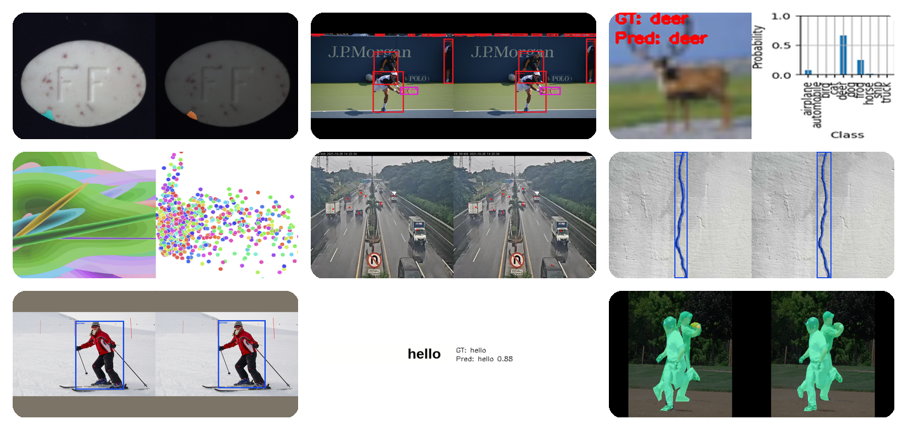

# Luxonis Training Framework


[](https://opensource.org/licenses/Apache-2.0)
![PyBadge](https://img.shields.io/pypi/pyversions/luxonis-train?logo=data:image/svg+xml%3Bbase64,PHN2ZyB4bWxucz0iaHR0cDovL3d3dy53My5vcmcvMjAwMC9zdmciIHZpZXdCb3g9IjAgMCAxMDAgMTAwIj4KICA8ZGVmcz4KICAgIDxsaW5lYXJHcmFkaWVudCBpZD0icHlZZWxsb3ciIGdyYWRpZW50VHJhbnNmb3JtPSJyb3RhdGUoNDUpIj4KICAgICAgPHN0b3Agc3RvcC1jb2xvcj0iI2ZlNSIgb2Zmc2V0PSIwLjYiLz4KICAgICAgPHN0b3Agc3RvcC1jb2xvcj0iI2RhMSIgb2Zmc2V0PSIxIi8+CiAgICA8L2xpbmVhckdyYWRpZW50PgogICAgPGxpbmVhckdyYWRpZW50IGlkPSJweUJsdWUiIGdyYWRpZW50VHJhbnNmb3JtPSJyb3RhdGUoNDUpIj4KICAgICAgPHN0b3Agc3RvcC1jb2xvcj0iIzY5ZiIgb2Zmc2V0PSIwLjQiLz4KICAgICAgPHN0b3Agc3RvcC1jb2xvcj0iIzQ2OCIgb2Zmc2V0PSIxIi8+CiAgICA8L2xpbmVhckdyYWRpZW50PgogIDwvZGVmcz4KCiAgPHBhdGggZD0iTTI3LDE2YzAtNyw5LTEzLDI0LTEzYzE1LDAsMjMsNiwyMywxM2wwLDIyYzAsNy01LDEyLTExLDEybC0yNCwwYy04LDAtMTQsNi0xNCwxNWwwLDEwbC05LDBjLTgsMC0xMy05LTEzLTI0YzAtMTQsNS0yMywxMy0yM2wzNSwwbDAtM2wtMjQsMGwwLTlsMCwweiBNODgsNTB2MSIgZmlsbD0idXJsKCNweUJsdWUpIi8+CiAgPHBhdGggZD0iTTc0LDg3YzAsNy04LDEzLTIzLDEzYy0xNSwwLTI0LTYtMjQtMTNsMC0yMmMwLTcsNi0xMiwxMi0xMmwyNCwwYzgsMCwxNC03LDE0LTE1bDAtMTBsOSwwYzcsMCwxMyw5LDEzLDIzYzAsMTUtNiwyNC0xMywyNGwtMzUsMGwwLDNsMjMsMGwwLDlsMCwweiBNMTQwLDUwdjEiIGZpbGw9InVybCgjcHlZZWxsb3cpIi8+CgogIDxjaXJjbGUgcj0iNCIgY3g9IjY0IiBjeT0iODgiIGZpbGw9IiNGRkYiLz4KICA8Y2lyY2xlIHI9IjQiIGN4PSIzNyIgY3k9IjE1IiBmaWxsPSIjRkZGIi8+Cjwvc3ZnPgo=)
[](https://github.com/astral-sh/ruff)

[](https://codecov.io/gh/luxonis/luxonis-train)

<a name="overview"></a>

## 🌟 Overview

`LuxonisTrain` is a user-friendly tool designed to streamline the training of deep learning models, especially for edge devices. Built on top of `PyTorch Lightning`, it simplifies the process of training, testing, and exporting models with minimal coding required.



### ✨ Key Features

- **No Coding Required**: Define your training pipeline entirely through a single `YAML` configuration file.
- **Predefined Configurations**: Utilize ready-made configs for common computer vision tasks to start quickly.
- **Customizable**: Extend functionality with custom components using an intuitive Python API.
- **Edge Optimized**: Focus on models optimized for deployment on edge devices with limited compute resources.

> [!WARNING]
> **The project is in a beta state and might be unstable or contain bugs - please report any feedback.**

<a name="quick-start"></a>

## 🚀 Quick Start

Get started with `LuxonisTrain` in just a few steps:

1. **Install `LuxonisTrain`**

   ```bash
   pip install luxonis-train
   ```

   This will create the `luxonis_train` executable in your `PATH`.

1. **Use the provided `configs/detection_light_model.yaml` configuration file**

   You can download the file by executing the following command:

   ```bash
   wget https://raw.githubusercontent.com/luxonis/luxonis-train/main/configs/detection_light_model.yaml
   ```

1. **Find a suitable dataset for your task**

   We will use a sample COCO dataset from `RoboFlow` in this example.

1. **Start training**

   ```bash
   luxonis_train train                   \
     --config detection_light_model.yaml \
     loader.params.dataset_dir "roboflow://team-roboflow/coco-128/2/coco"
   ```

1. **Monitor progress with `TensorBoard`**

   ```bash
   tensorboard --logdir output/tensorboard_logs
   ```

   Open the provided URL in your browser to visualize the training progress

> [!NOTE]
> For hands-on examples of how to prepare data with `LuxonisML` and train AI models using `LuxonisTrain`, check out [this guide](https://github.com/luxonis/ai-tutorials/tree/main/training#-luxonis-train-tutorials).

## 📜 Table Of Contents

- [🌟 Overview](#overview)
  - [✨ Key Features](#key-features)
- [🚀 Quick Start](#quick-start)
- [🛠️ Installation](#installation)
- [📝 Usage](#usage)
  - [💻 CLI](#cli)
- [⚙️ Configuration](#configuration)
- [🗃️ Data Preparation](#data-preparation)
  - [📂 Data Directory](#data-directory)
  - [💾 `LuxonisDataset`](#luxonis-dataset)
- [🏋️‍♂️Training](#training)
- [✍ Testing](#testing)
- [🧠 Inference](#inference)
- [🤖 Exporting](#exporting)
- [🗂️ NN Archive](#nn-archive)
- [🔬 Tuning](#tuning)
- [🎨 Customizations](#customizations)
- [📚 Tutorials and Examples](#tutorials-and-examples)
- [🔑 Credentials](#credentials)
- [🤝 Contributing](#contributing)

<a name="installation"></a>

## 🛠️ Installation

`LuxonisTrain` requires **Python 3.10** or higher. We recommend using a virtual environment to manage dependencies.

**Install via `pip`**:

```bash
pip install luxonis-train
```

This will also install the `luxonis_train` CLI. For more information on how to use it, see [CLI Usage](#cli).

<a name="usage"></a>

## 📝 Usage

You can use `LuxonisTrain` either from the **command line** or via the **Python API**.
We will demonstrate both ways in the following sections.

<a name="cli"></a>

### 💻 CLI

The CLI is the most straightforward way how to use `LuxonisTrain`. The CLI provides several commands for training, testing, tuning, exporting and more.

**Available commands:**

- `train` - Start the training process
- `test` - Test the model on a specific dataset view
- `infer` - Run inference on a dataset, image directory, or a video file.
- `export` - Export the model to either `ONNX` or `BLOB` format that can be run on edge devices
- `archive` - Create an `NN Archive` file that can be used with our `DepthAI` API (coming soon)
- `tune` - Tune the hyperparameters of the model for better performance
- `inspect` - Inspect the dataset you are using and visualize the annotations
- `annotate` - Annotate a directory using the model’s predictions and generate a new LDF.

**To get help on any command:**

```bash
luxonis_train <command> --help
```

Specific usage examples can be found in the respective sections below.

<a name="configuration"></a>

## ⚙️ Configuration

`LuxonisTrain` uses `YAML` configuration files to define the training pipeline. Here's a breakdown of the key sections:

```yaml
model:
  name: model_name

  # Use a predefined detection model instead of defining
  # the model architecture manually
  predefined_model:
    name: DetectionModel
    params:
      variant: light

# Download and parse the coco dataset from RoboFlow.
# Save it internally as `coco_test` dataset for future reference.
loader:
  params:
    dataset_name: coco_test
    dataset_dir: "roboflow://team-roboflow/coco-128/2/coco"

trainer:
  batch_size: 8
  epochs: 200
  n_workers: 8
  validation_interval: 10

  preprocessing:
    train_image_size: [384, 384]

    # Uses the imagenet normalization by default
    normalize:
      active: true

    # Augmentations are powered by Albumentations
    augmentations:
      - name: Defocus
      - name: Sharpen
      - name: Flip

  callbacks:
    - name: ExportOnTrainEnd
    - name: ArchiveOnTrainEnd
    - name: TestOnTrainEnd

  optimizer:
    name: SGD
    params:
      lr: 0.02

  scheduler:
    name: ConstantLR
```

### 📚 Configuration Reference

**For a complete reference of all available configuration options, see our [Configuration Documentation](configs/README.md).**

> [!TIP]
> We provide a set of predefined configuration files for common computer vision tasks in the `configs` directory.
> These are great starting points that you can customize for your specific needs.

<a name="data-preparation"></a>

## 🗃️ Data Preparation

`LuxonisTrain` supports several ways of loading data:

- using a data directory in one of the supported formats
- using an already existing dataset in our custom `LuxonisDataset` format
- using a custom loader
  - to learn how to implement and use custom loaders, see [Customizations](#customizations)

<a name="data-directory"></a>

### 📂 Data Directory

The easiest way to load data is to use a directory with the dataset in one of the supported formats.

**Supported formats:**

- `COCO` - We support COCO JSON format in two variants:
  - [`RoboFlow`](https://roboflow.com/formats/coco-json)
  - [`FiftyOne`](https://docs.voxel51.com/user_guide/export_datasets.html#cocodetectiondataset-export)
- [`Pascal VOC XML`](https://roboflow.com/formats/pascal-voc-xml)
- [`YOLO Darknet TXT`](https://roboflow.com/formats/yolo-darknet-txt)
- [`YOLOv4 PyTorch TXT`](https://roboflow.com/formats/yolov4-pytorch-txt)
- [`MT YOLOv6`](https://roboflow.com/formats/mt-yolov6)
- [`CreateML JSON`](https://roboflow.com/formats/createml-json)
- [`TensorFlow Object Detection CSV`](https://roboflow.com/formats/tensorflow-object-detection-csv)
- `Classification Directory` - A directory with subdirectories for each class
  ```plaintext
  dataset_dir/
  ├── train/
  │   ├── class1/
  │   │   ├── img1.jpg
  │   │   ├── img2.jpg
  │   │   └── ...
  │   ├── class2/
  │   └── ...
  ├── valid/
  └── test/
  ```
- `Segmentation Mask Directory` - A directory with images and corresponding masks.
  ```plaintext
  dataset_dir/
  ├── train/
  │   ├── img1.jpg
  │   ├── img1_mask.png
  │   ├── ...
  │   └── _classes.csv
  ├── valid/
  └── test/
  ```
  The masks are stored as grayscale `PNG` images where each pixel value corresponds to a class.
  The mapping from pixel values to classes is defined in the `_classes.csv` file.
  ```csv
  Pixel Value, Class
  0, background
  1, class1
  2, class2
  3, class3
  ```

#### Preparing your Data

1. Organize your dataset into one of the supported formats.
1. Place your dataset in a directory accessible by the training script.
1. Update the `dataset_dir` parameter in the configuration file to point to the dataset directory.

**The `dataset_dir` can be one of the following:**

- Local path to the dataset directory
- URL to a remote dataset
  - The dataset will be downloaded to a `"data"` directory in the current working directory
  - **Supported URL protocols:**
    - `s3://bucket/path/to/directory` fo **AWS S3**
    - `gs://buclet/path/to/directory` for **Google Cloud Storage**
    - `roboflow://workspace/project/version/format` for **RoboFlow**
      - `workspace` - name of the workspace the dataset belongs to
      - `project` - name of the project the dataset belongs to
      - `version` - version of the dataset
      - `format` - one of `coco`, `darknet`, `voc`, `yolov4pytorch`, `mt-yolov6`, `createml`, `tensorflow`, `folder`, `png-mask-semantic`
      - **example:** `roboflow://team-roboflow/coco-128/2/coco`

**Example:**

```yaml
loader:
  params:
    dataset_name: "coco_test"
    dataset_dir: "roboflow://team-roboflow/coco-128/2/coco"
```

<a name="luxonis-dataset"></a>

### 💾 `LuxonisDataset`

`LuxonisDataset` is our custom dataset format designed for easy and efficient dataset management.
To learn more about how to create a dataset in this format from scratch, see the [Luxonis ML](https://github.com/luxonis/luxonis-ml) repository.

To use the `LuxonisDataset` as a source of the data, specify the following in the config file:

```yaml
loader:
  params:
    # name of the dataset
    dataset_name: "dataset_name"

    # one of local (default), s3, gcs
    bucket_storage: "local"
```

> [!TIP]
> To inspect the loader output, use the `luxonis_train inspect` command:
>
> ```bash
> luxonis_train inspect --config configs/detection_light_model.yaml
> ```
>
> **The `inspect` command is currently only available in the CLI**

For additional information about the shapes of Luxonis ML data that the loader returns, please refer to the [Loaders README](luxonis_train/loaders/README.md).

<a name="training"></a>

## 🏋️‍♂️ Training

Once your configuration file and dataset are ready, start the training process.

**CLI:**

```bash
luxonis_train train --config configs/detection_light_model.yaml
```

> [!TIP]
> To change a configuration parameter from the command line, use the following syntax:
>
> ```bash
> luxonis_train train                           \
>   --config configs/detection_light_model.yaml \
>   loader.params.dataset_dir "roboflow://team-roboflow/coco-128/2/coco"
> ```

**Python API:**

```python
from luxonis_train import LuxonisModel

model = LuxonisModel(
  "configs/detection_light_model.yaml",
  {"loader.params.dataset_dir": "roboflow://team-roboflow/coco-128/2/coco"}
)
model.train()
```

**Expected Output:**

```log
INFO     Using predefined model: `DetectionModel`
INFO     Main metric: `MeanAveragePrecision`
INFO     GPU available: True (cuda), used: True
INFO     TPU available: False, using: 0 TPU cores
INFO     HPU available: False, using: 0 HPUs
...
INFO     Training finished
INFO     Checkpoints saved in: output/1-coral-wren
```

**Monitoring with `TensorBoard`:**

If not explicitly disabled, the training process will be monitored by `TensorBoard`. To start the `TensorBoard` server, run:

```bash
tensorboard --logdir output/tensorboard_logs
```

Open the provided URL to visualize training metrics.

<a name="testing"></a>

## ✍ Testing

Evaluate your trained model on a specific dataset view (`train`, `val`, or `test`).

**CLI:**

```bash
luxonis_train test --config configs/detection_light_model.yaml \
                   --view val                                  \
                   --weights path/to/checkpoint.ckpt
```

**Python API:**

```python
from luxonis_train import LuxonisModel

model = LuxonisModel("configs/detection_light_model.yaml")
model.test(weights="path/to/checkpoint.ckpt")
```

The testing process can be started automatically at the end of the training by using the `TestOnTrainEnd` callback.
To learn more about callbacks, see [Callbacks](https://github.com/luxonis/luxonis-train/blob/main/luxonis_train/callbacks/README.md).

<a name="inference"></a>

## 🧠 Inference

Run inference on images, datasets, or videos.

**CLI:**

- **Inference on a Dataset View:**

```bash
luxonis_train infer --config configs/detection_light_model.yaml \
                    --view val                                  \
                    --weights path/to/checkpoint.ckpt
```

- **Inference on a Video File:**

```bash
luxonis_train infer --config configs/detection_light_model.yaml \
                    --weights path/to/checkpoint.ckpt           \
                    --source-path path/to/video.mp4
```

- **Inference on an Image Directory:**

```bash
luxonis_train infer --config configs/detection_light_model.yaml \
                    --weights path/to/checkpoint.ckpt           \
                    --source-path path/to/images                \
                    --save-dir path/to/save_directory
```

**Python API:**

```python
from luxonis_train import LuxonisModel

model = LuxonisModel("configs/detection_light_model.yaml")

# infer on a dataset view
model.infer(weights="path/to/checkpoint.ckpt", view="val")

# infer on a video file
model.infer(weights="path/to/checkpoint.ckpt", source_path="path/to/video.mp4")

# infer on an image directory and save the results
model.infer(
    weights="path/to/checkpoint.ckpt",
    source_path="path/to/images",
    save_dir="path/to/save_directory",
)
```

<a name="exporting"></a>

## 🤖 Exporting

Export your trained models to formats suitable for deployment on edge devices.

Supported formats:

- **ONNX**: Open Neural Network Exchange format.
- **BLOB**: Format compatible with OAK-D cameras.

To configure the exporter, you can specify the [exporter](https://github.com/luxonis/luxonis-train/blob/main/configs/README.md#exporter) section in the config file.

You can see an example export configuration [here](https://github.com/luxonis/luxonis-train/blob/main/configs/example_export.yaml).

**CLI:**

```bash
luxonis_train export --config configs/example_export.yaml --weights path/to/weights.ckpt
```

**Python API:**

```python
from luxonis_train import LuxonisModel

model = LuxonisModel("configs/example_export.yaml")
model.export(weights="path/to/weights.ckpt")
```

Model export can be run automatically at the end of the training by using the `ExportOnTrainEnd` callback.

The exported models are saved in the export directory within your `output` folder.

<a name="nn-archive"></a>

## 🗂️ NN Archive

Create an `NN Archive` file for easy deployment with the `DepthAI` API.

The archive contains the exported model together with all the metadata needed for running the model.

**CLI:**

```bash
luxonis_train archive                         \
  --config configs/detection_light_model.yaml \
  --weights path/to/checkpoint.ckpt
```

**Python API:**

```python
from luxonis_train import LuxonisModel

model = LuxonisModel("configs/detection_light_model.yaml")
model.archive(weights="path/to/checkpoint.ckpt")
```

The archive can be created automatically at the end of the training by using the `ArchiveOnTrainEnd` callback.

<a name="tuning"></a>

## 🔬 Tuning

Optimize your model's performance using hyperparameter tuning powered by [`Optuna`](https://optuna.org/).

**Configuration:**

Include a [`tuner`](https://github.com/luxonis/luxonis-train/blob/main/configs/README.md#tuner) section in your configuration file.

```yaml

tuner:
  study_name: det_study
  n_trials: 10
  storage:
    backend: sqlite
  params:
    trainer.optimizer.name_categorical: ["Adam", "SGD"]
    trainer.optimizer.params.lr_float: [0.0001, 0.001]
    trainer.batch_size_int: [4, 16, 4]
```

**CLI:**

```bash
luxonis_train tune --config configs/example_tuning.yaml
```

**Python API:**

```python
from luxonis_train import LuxonisModel

model = LuxonisModel("configs/example_tuning.yaml")
model.tune()
```

<a name="customizations"></a>

## 🎨 Customizations

`LuxonisTrain` is highly modular, allowing you to customize various components:

- [**Loaders**](https://github.com/luxonis/luxonis-train/blob/main/luxonis_train/loaders/README.md): Handles data loading and preprocessing.
- [**Nodes**](https://github.com/luxonis/luxonis-train/blob/main/luxonis_train/nodes/README.md): Represents computational units in the model architecture.
- [**Losses**](https://github.com/luxonis/luxonis-train/blob/main/luxonis_train/attached_modules/losses/README.md): Define the loss functions used to train the model.
- [**Metrics**](https://github.com/luxonis/luxonis-train/blob/main/luxonis_train/attached_modules/metrics/README.md): Measure the model's performance during training.
- [**Visualizers**](https://github.com/luxonis/luxonis-train/blob/main/luxonis_train/attached_modules/visualizers/README.md): Visualize the model's predictions during training.
- [**Callbacks**](https://github.com/luxonis/luxonis-train/blob/main/luxonis_train/callbacks/README.md): Allow custom code to be executed at different stages of training.
- [**Optimizers**](https://github.com/luxonis/luxonis-train/blob/main/configs/README.md#optimizer): Control how the model's weights are updated.
- [**Schedulers**](https://github.com/luxonis/luxonis-train/blob/main/configs/README.md#scheduler): Adjust the learning rate during training.
- [**Training Strategy**](https://github.com/luxonis/luxonis-train/blob/main/configs/README.md#training-strategy): Specify a custom combination of optimizer and scheduler to tailor the training process for specific use cases.

**Creating Custom Components:**

Implement custom components by subclassing the respective base classes and/or registering them.
Registered components can be referenced in the config file. Custom components need to inherit from their respective base classes:

- **Loaders** - [`BaseLoaderTorch`](https://github.com/luxonis/luxonis-train/blob/main/luxonis_train/loaders/base_loader.py)
- **Nodes** - [`BaseNode`](https://github.com/luxonis/luxonis-train/blob/main/luxonis_train/models/nodes/base_node.py)
- **Losses** - [`BaseLoss`](https://github.com/luxonis/luxonis-train/blob/main/luxonis_train/attached_modules/losses/base_loss.py)
- **Metrics** - [`BaseMetric`](https://github.com/luxonis/luxonis-train/blob/main/luxonis_train/attached_modules/metrics/base_metric.py)
- **Visualizers** - [`BaseVisualizer`](https://github.com/luxonis/luxonis-train/blob/main/luxonis_train/attached_modules/visualizers/base_visualizer.py)
- **Callbacks** - [`lightning.pytorch.callbacks.Callback`](https://lightning.ai/docs/pytorch/stable/extensions/callbacks.html), requires manual registration to the `CALLBACKS` registry
- **Optimizers** - [`torch.optim.Optimizer`](https://pytorch.org/docs/stable/optim.html#torch.optim.Optimizer), requires manual registration to the `OPTIMIZERS` registry
- **Schedulers** - [`torch.optim.lr_scheduler.LRScheduler`](https://pytorch.org/docs/stable/optim.html#how-to-adjust-learning-rate), requires manual registration to the `SCHEDULERS` registry
- **Training Strategy** - [`BaseTrainingStrategy`](https://github.com/luxonis/luxonis-train/blob/main/luxonis_train/strategies/base_strategy.py)

**Examples:**

**Custom Callback:**

```python
import lightning.pytorch as pl

from luxonis_train import LuxonisLightningModule
from luxonis_train.registry import CALLBACKS


@CALLBACKS.register()
class CustomCallback(pl.Callback):
    def __init__(self, message: str, **kwargs):
        super().__init__(**kwargs)
        self.message = message

    # Will be called at the end of each training epoch.
    # Consult the PyTorch Lightning documentation for more callback methods.
    def on_train_epoch_end(
        self,
        trainer: pl.Trainer,
        pl_module: LuxonisLightningModule,
    ) -> None:
        print(self.message)
```

**Custom Loss:**

```python
from torch import Tensor

from luxonis_train import BaseLoss, Tasks

# Subclasses of `BaseNode`, `BaseLoss`, `BaseMetric`
# and `BaseVisualizer` are registered automatically.
class CustomLoss(BaseLoss):
    supported_tasks = [Tasks.CLASSIFICATION, Tasks.SEGMENTATION]

    def __init__(self, smoothing: float, **kwargs):
        super().__init__(**kwargs)
        self.smoothing = smoothing

    def forward(self, predictions: Tensor, targets: Tensor) -> Tensor:
        # Implement the actual loss logic here
        value = predictions.sum() * self.smoothing
        return value.abs()
```

For additional examples of creating custom components, please refer to the [examples section](examples/README.md).

**Using custom components in the configuration file:**

```yaml
model:
  nodes:
  - name: SegmentationHead
    losses:
    - name: CustomLoss
      params:
        smoothing: 0.0001

trainer:
  callbacks:
    - name: CustomCallback
      params:
        lr: "Hello from the custom callback!"
```

> [!NOTE]
> Files containing the custom components must be sourced before the training script is run.
> To do that in CLI, you can use the `--source` argument:
>
> ```bash
> luxonis_train --source custom_components.py train --config config.yaml
> ```

**Python API:**

You have to import the custom components before creating the `LuxonisModel` instance.

```python
from custom_components import *
from luxonis_train import LuxonisModel

model = LuxonisModel("config.yaml")
model.train()
```

For more information on how to define custom components, consult the respective in-source documentation.

<a name="tutorials-and-examples"></a>

## 📚 Tutorials and Examples

We are actively working on providing examples and tutorials for different parts of the library which will help you to start more easily. The tutorials can be found [here](https://github.com/luxonis/ai-tutorials/tree/main/training) and will be updated regularly.

<a name="credentials"></a>

## 🔑 Credentials

When using cloud services, avoid hard-coding credentials or placing them directly in your configuration files.
Instead:

- Use environment variables to store sensitive information.
- Use a `.env` file and load it securely, ensuring it's excluded from version control.

**Supported Cloud Services:**

- **AWS S3**, requires:
  - `AWS_ACCESS_KEY_ID`
  - `AWS_SECRET_ACCESS_KEY`
  - `AWS_S3_ENDPOINT_URL`
- **Google Cloud Storage**, requires:
  - `GOOGLE_APPLICATION_CREDENTIALS`
- **RoboFlow**, requires:
  - `ROBOFLOW_API_KEY`

**For logging and tracking, we support:**

- **MLFlow**, requires:
  - `MLFLOW_S3_BUCKET`
  - `MLFLOW_S3_ENDPOINT_URL`
  - `MLFLOW_TRACKING_URI`
- **WandB**, requires:
  - `WANDB_API_KEY`

**For remote database storage, we support:**

- `POSTGRES_PASSWORD`
- `POSTGRES_HOST`
- `POSTGRES_PORT`
- `POSTGRES_DB`

<a name="contributing"></a>

## 🤝 Contributing

We welcome contributions! Please read our [Contribution Guide](https://github.com/luxonis/luxonis-train/blob/main/CONTRIBUTING.md) to get started. Whether it's reporting bugs, improving documentation, or adding new features, your help is appreciated.
