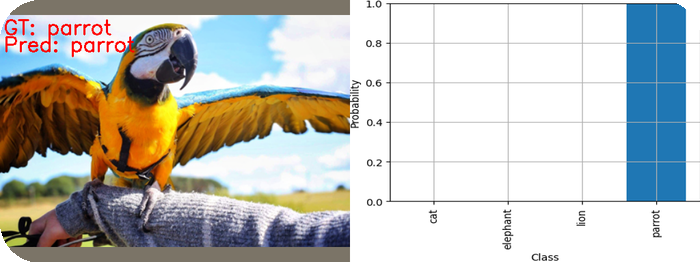

# Visualizers

Visualizers are used to render the output of a node. They are used in the `visualizers` field of the `Node` configuration.

## Table Of Contents

- [`BBoxVisualizer`](#bboxvisualizer)
- [`ClassificationVisualizer`](#classificationvisualizer)
- [`KeypointVisualizer`](#keypointvisualizer)
- [`SegmentationVisualizer`](#segmentationvisualizer)
- [`EmbeddingsVisualizer`](#embeddingsvisualizer)
- [`OCRVisualizer`](#ocrvisualizer)
- [`InstanceSegmentationVisualizer`](#instancesegmentationvisualizer)

## `BBoxVisualizer`

Visualizer for bounding boxes.

**Parameters:**

| Key         | Type                                                                                  | Default value | Description                                                                                                                                                             |
| ----------- | ------------------------------------------------------------------------------------- | ------------- | ----------------------------------------------------------------------------------------------------------------------------------------------------------------------- |
| `labels`    | `dict[int, str] \| list[str] \| None`                                                 | `None`        | Either a dictionary mapping class indices to names, or a list of names. If list is provided, the label mapping is done by index. By default, no labels are drawn        |
| `colors`    | `dict[int, tuple[int, int, int] \| str] \| list[tuple[int, int, int] \| str] \| None` | `None`        | Colors to use for the bounding boxes. Either a dictionary mapping class names to colors, or a list of colors. Color can be either a tuple of RGB values or a hex string |
| `fill`      | `bool`                                                                                | `False`       | Whether to fill the bounding boxes                                                                                                                                      |
| `width`     | `int`                                                                                 | `1`           | The width of the bounding box lines                                                                                                                                     |
| `font`      | `str \| None`                                                                         | `None`        | A filename containing a `TrueType` font                                                                                                                                 |
| `font_size` | `int \| None`                                                                         | `None`        | Font size used for the labels                                                                                                                                           |

**Example:**

## `KeypointVisualizer`

**Parameters:**

| Key                    | Type                                   | Default value | Description                                                                                                                     |
| ---------------------- | -------------------------------------- | ------------- | ------------------------------------------------------------------------------------------------------------------------------- |
| `visibility_threshold` | `float`                                | `0.5`         | Threshold for visibility of keypoints. If the visibility of a keypoint is below this threshold, it is considered as not visible |
| `connectivity`         | `list[tuple[int, int]] \| None`        | `None`        | List of tuples of keypoint indices that define the connections in the skeleton                                                  |
| `visible_color`        | `str \| tuple[int, int, int]`          | `"red"`       | Color of visible keypoints                                                                                                      |
| `nonvisible_color`     | `str \| tuple[int, int, int ] \| None` | `None`        | Color of non-visible keypoints. If `None`, non-visible keypoints are not drawn                                                  |

**Example:**

## `SegmentationVisualizer`

**Parameters:**

| Key     | Type                          | Default value | Description                           |
| ------- | ----------------------------- | ------------- | ------------------------------------- |
| `color` | `str \| tuple[int, int, int]` | `"#5050FF"`   | Color of the segmentation masks       |
| `alpha` | `float`                       | `0.6`         | Alpha value of the segmentation masks |

**Example:**

## `ClassificationVisualizer`

**Parameters:**

| Key            | Type                   | Default value | Description                                                                      |
| -------------- | ---------------------- | ------------- | -------------------------------------------------------------------------------- |
| `include_plot` | `bool`                 | `True`        | Whether to include a plot of the class probabilities in the visualization        |
| `color`        | `tuple[int, int, int]` | `(255, 0, 0)` | Color of the text                                                                |
| `font_scale`   | `float`                | `1.0`         | Scale of the font                                                                |
| `thickness`    | `int`                  | `1`           | Line thickness of the font                                                       |
| `multi_label`  | `bool`                 | `False`       | Set to `True` for multi-label classification, otherwise `False` for single-label |

**Example:**

## `EmbeddingsVisualizer`

**Parameters:**

| Key                 | Type    | Default value | Description                                                                                                                   |
| ------------------- | ------- | ------------- | ----------------------------------------------------------------------------------------------------------------------------- |
| `z_score_threshold` | `float` | `3.0`         | Threshold for z-score filtering. Embeddings with z-score higher than this value are considered as outliers and are not drawn. |

**Example:**

## `OCRVisualizer`

Visualizer for OCR tasks.

**Parameters:**

| Key          | Type                   | Default value | Description                                 |
| ------------ | ---------------------- | ------------- | ------------------------------------------- |
| `font_scale` | `float`                | `0.5`         | Font scale of the text. Defaults to `0.5`.  |
| `color`      | `tuple[int, int, int]` | `(0, 0, 0)`   | Color of the text. Defaults to `(0, 0, 0)`. |
| `thickness`  | `int`                  | `1`           | Thickness of the text. Defaults to `1`.     |

**Example:**

## `InstanceSegmentationVisualizer`

Visualizer for instance segmentation tasks.

**Parameters:**

| Key         | Type                                                                                  | Default value | Description                                                                                                                                                             |
| ----------- | ------------------------------------------------------------------------------------- | ------------- | ----------------------------------------------------------------------------------------------------------------------------------------------------------------------- |
| `labels`    | `dict[int, str] \| list[str] \| None`                                                 | `None`        | Either a dictionary mapping class indices to names, or a list of names. If list is provided, the label mapping is done by index. By default, no labels are drawn        |
| `colors`    | `dict[int, tuple[int, int, int] \| str] \| list[tuple[int, int, int] \| str] \| None` | `None`        | Colors to use for the bounding boxes. Either a dictionary mapping class names to colors, or a list of colors. Color can be either a tuple of RGB values or a hex string |
| `fill`      | `bool`                                                                                | `False`       | Whether to fill the bounding boxes                                                                                                                                      |
| `width`     | `int`                                                                                 | `1`           | The width of the bounding box lines                                                                                                                                     |
| `font`      | `str \| None`                                                                         | `None`        | A filename containing a `TrueType` font                                                                                                                                 |
| `font_size` | `int \| None`                                                                         | `None`        | Font size used for the labels                                                                                                                                           |

**Example:**

