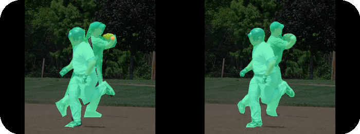
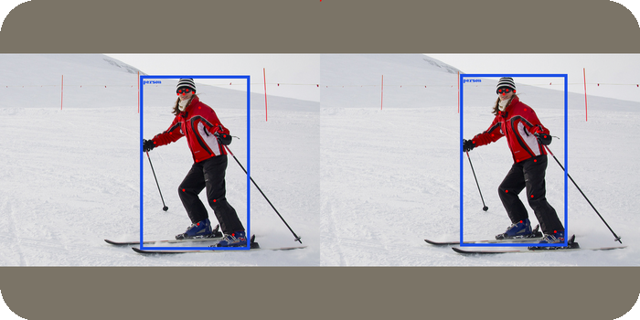

# Nodes

Nodes are the basic building structures of the model. They can be connected together
arbitrarily as long as the two nodes are compatible with each other. We've grouped together nodes that are similar, so it's easier to build an architecture that makes sense.

## Table Of Contents

- [Backbones](#backbones)
  - [`ResNet`](#resnet)
  - [`MicroNet`](#micronet)
  - [`RepVGG`](#repvgg)
  - [`EfficientRep`](#efficientrep)
  - [`RexNetV1_lite`](#rexnetv1_lite)
  - [`MobileOne`](#mobileone)
  - [`MobileNetV2`](#mobilenetv2)
  - [`EfficientNet`](#efficientnet)
  - [`ContextSpatial`](#contextspatial)
  - [`DDRNet`](#ddrnet)
  - [`RecSubNet`](#recsubnet)
  - [`PPLCNetV3`](#pplcnetv3)
  - [`EfficientViT`](#efficientvit)
  - [`GhostFaceNet`](#ghostfacenet)
- [Necks](#necks)
  - [`RepPANNeck`](#reppanneck)
  - [`SVTRNeck`](#svtrneck)
- [Heads](#heads)
  - [Classification Heads](#classification-heads)
    - [`ClassificationHead`](#classificationhead)
  - [Segmentation Heads](#segmentation-heads)
    - [`SegmentationHead`](#segmentationhead)
    - [`BiSeNetHead`](#bisenethead)
    - [`DDRNetSegmentationHead`](#ddrnetsegmentationhead)
  - [Bounding Box Detection Heads](#bounding-box-heads)
    - [`EfficientBBoxHead`](#efficientbboxhead)
    - [`PrecisionBBoxHead`](#precisionbboxhead)
  - [Instance Keypoint Detection Heads](#instance-keypoint-detection-heads)
    - [`EfficientKeypointBBoxHead`](#efficientkeypointbboxhead)
    - [`FOMOHead`](#fomohead)
  - [Instance Segmentation Heads](#instance-segmentation-heads)
    - [`PrecisionSegmentBBoxHead`](#precisionsegmentbboxhead)
  - [Unsupervised Anomaly Detection Heads](#unsupervised-anomaly-detection-heads)
    - [`DiscSubNetHead`](#discsubnethead)
  - [OCR Heads](#ocr-heads)
    - [`OCRCTCHead`](#ocrctchead)
  - [Embedding Heads](#embedding-heads)
    - [`GhostFaceNetHead`](#ghostfacenethead)

Every node takes these parameters:

| Key                | Type          | Default value | Description                                                                 |
| ------------------ | ------------- | ------------- | --------------------------------------------------------------------------- |
| `n_classes`        | `int \| None` | `None`        | Number of classes in the dataset. Inferred from the dataset if not provided |
| `remove_on_export` | `bool`        | `False`       | Whether node should be removed when exporting the whole model               |

In addition, the following class attributes can be overridden:

| Key            | Type                                                              | Default value | Description                                                                                                                                                                                                                     |
| -------------- | ----------------------------------------------------------------- | ------------- | ------------------------------------------------------------------------------------------------------------------------------------------------------------------------------------------------------------------------------- |
| `attach_index` | `int \| "all" \| tuple[int, int] \| tuple[int, int, int] \| None` | `None`        | Index of previous output that the head attaches to. Each node has a sensible default. Usually should not be manually set in most cases. Can be either a single index, a slice (negative indexing is also supported), or `"all"` |
| `task`         | `Task \| None`                                                    | `None`        | List of tasks types supported by the node. Should be overridden for head nodes.                                                                                                                                                 |
| `variant`      | `str \| None`                                                     | `None`        | Some nodes specify predefined variants of the architecture. This attribute can be used to indicate which variant should be used.                                                                                                |

Additional parameters for specific nodes are listed below.

## Backbones

### `ResNet`

Adapted from [here](https://pytorch.org/vision/main/models/resnet.html).

**Parameters:**

| Key       | Type                                      | Default value | Description            |
| --------- | ----------------------------------------- | ------------- | ---------------------- |
| `variant` | `Literal["18", "34", "50", "101", "152"]` | `"18"`        | Variant of the network |

### `DinoV3`

Adapted from [here](https://github.com/facebookresearch/dinov3)

| Key       | Type                                                                                                                                                 | Default value | Description            |
| --------- | ---------------------------------------------------------------------------------------------------------------------------------------------------- | ------------- | ---------------------- |
| `variant` | `Literal["vits16", "vits16plus", "vitb16", "vitl16", "vith16plus", "vit7b16", "convnext_tiny", "convnext_small", "convnext_base", "convnext_large"]` | `"vitb16"`    | Variant of the network |

### `MicroNet`

Adapted from [here](https://github.com/liyunsheng13/micronet).

**Parameters:**

| Key       | Type                        | Default value | Description            |
| --------- | --------------------------- | ------------- | ---------------------- |
| `variant` | `Literal["M1", "M2", "M3"]` | `"M1"`        | Variant of the network |

### `RepVGG`

Adapted from [here](https://github.com/DingXiaoH/RepVGG).

**Parameters:**

| Key       | Type                        | Default value | Description            |
| --------- | --------------------------- | ------------- | ---------------------- |
| `variant` | `Literal["A0", "A1", "A2"]` | `"A0"`        | Variant of the network |

### `EfficientRep`

Adapted from [here](https://arxiv.org/pdf/2209.02976.pdf).

**Parameters:**

| Key             | Type                                                              | Default value             | Description                                                                |
| --------------- | ----------------------------------------------------------------- | ------------------------- | -------------------------------------------------------------------------- |
| `variant`       | `Literal["n", "nano", "s", "small", "m", "medium", "l", "large"]` | `"nano"`                  | Variant of the network                                                     |
| `channels_list` | `list[int]`                                                       | [64, 128, 256, 512, 1024] | List of number of channels for each block                                  |
| `n_repeats`     | `list[int]`                                                       | [1, 6, 12, 18, 6]         | List of number of repeats of `RepVGGBlock`                                 |
| `depth_mul`     | `float`                                                           | `0.33`                    | Depth multiplier                                                           |
| `width_mul`     | `float`                                                           | `0.25`                    | Width multiplier                                                           |
| `block`         | `Literal["RepBlock", "CSPStackRepBlock"]`                         | `"RepBlock"`              | Base block used                                                            |
| `csp_e`         | `float`                                                           | `0.5`                     | Factor for intermediate channels when block is set to `"CSPStackRepBlock"` |

### RexNetV1_lite

Adapted from [here](https://github.com/clovaai/rexnet)

**Parameters:**

| Key               | Type               | Default value | Description                   |
| ----------------- | ------------------ | ------------- | ----------------------------- |
| `fix_head_stem`   | `bool`             | `False`       | Whether to multiply head stem |
| `divisible_value` | `int`              | `8`           | Divisor used                  |
| `input_ch`        | `int`              | `16`          | tarting channel dimension     |
| `final_ch`        | `int`              | `164`         | Final channel dimension       |
| `multiplier`      | `float`            | `1.0`         | Channel dimension multiplier  |
| `kernel_sizes`    | `int \| list[int]` | `3`           | Kernel sizes                  |

### `MobileOne`

Adapted from [here](https://github.com/apple/ml-mobileone).

**Parameters:**

| Key       | Type                                    | Default value | Description            |
| --------- | --------------------------------------- | ------------- | ---------------------- |
| `variant` | `Literal["s0", "s1", "s2", "s3", "s4"]` | `"s0"`        | Variant of the network |

### `MobileNetV2`

Adapted from [here](https://pytorch.org/vision/main/models/generated/torchvision.models.mobilenet_v2.html).

**Parameters:**

| Key           | Type        | Default value    | Description                  |
| ------------- | ----------- | ---------------- | ---------------------------- |
| `out_indices` | `list[int]` | `[3, 6, 13, 18]` | Indices of the output layers |

### `EfficientNet`

Adapted from [here](https://github.com/rwightman/gen-efficientnet-pytorch).

**Parameters:**

| Key           | Type        | Default value     | Description                  |
| ------------- | ----------- | ----------------- | ---------------------------- |
| `out_indices` | `list[int]` | `[0, 1, 2, 4, 6]` | Indices of the output layers |

### `ContextSpatial`

Adapted from [here](https://github.com/taveraantonio/BiseNetv1).

**Parameters:**

| Key                | Type  | Default value   | Description                                                                                          |
| ------------------ | ----- | --------------- | ---------------------------------------------------------------------------------------------------- |
| `context_backbone` | `str` | `"MobileNetV2"` | Backbone used for the context path. Must be a reference to a node registered in the `NODES` registry |

### `DDRNet`

Adapted from [here](https://github.com/ydhongHIT/DDRNet)

**Parameters:**

| Key       | Type                       | Default value | Description            |
| --------- | -------------------------- | ------------- | ---------------------- |
| `variant` | `Literal["23-slim", "23"]` | `"23-slim"`   | Variant of the network |

### `PPLCNetV3`

Adapted from [here](https://github.com/PaddlePaddle/PaddleOCR)

**Parameters:**

| Key            | Type                 | Default value | Description                    |
| -------------- | -------------------- | ------------- | ------------------------------ |
| `variant`      | Literal["rec-light"] | `"rec-light"` | Variant of the network         |
| `scale`        | `float`              | `0.95`        | Scale factor for the model     |
| `conv_kxk_num` | `int`                | `4`           | Number of convolutional layers |
| `det`          | `bool`               | `False`       | Whether to use for detection   |
| `net_config`   | `dict`               | `None`        | Configuration for the network  |
| `max_text_len` | `int`                | `40`          | Maximum length of the text     |

### `RecSubNet`

Adapted from [here](https://arxiv.org/abs/2108.07610)

**Parameters:**

| Key       | Type                | Default value | Description            |
| --------- | ------------------- | ------------- | ---------------------- |
| `variant` | `Literal["n", "l"]` | `"l"`         | Variant of the network |

### `EfficientViT`

Adapted from [here](https://arxiv.org/abs/2205.14756)

> [!NOTE]
> Tested export functionality with `opset_version` set to 16.

**Parameters:**

| Key            | Type                                                              | Default value                    | Description                                         |
| -------------- | ----------------------------------------------------------------- | -------------------------------- | --------------------------------------------------- |
| `variant`      | `Literal["n", "nano", "s", "small", "m", "medium", "l", "large"]` | `"nano"`                         | Variant of the network                              |
| `width_list`   | `list[int]`                                                       | `[256, 256, 256, 256, 256, 512]` | List of number of channels for each block           |
| `depth_list`   | `list[int]`                                                       | `[12, 12, 12, 12]`               | List of number of repeats of `EfficientViTBlock`    |
| `expand_ratio` | `int`                                                             | `4`                              | Factor by which channels expand in the local module |
| `dim`          | `int`                                                             | `None`                           | Dimension size for each attention head              |

### `GhostFaceNet`

**Parameters:**

| Key       | Type            | Default value | Description                 |
| --------- | --------------- | ------------- | --------------------------- |
| `variant` | `Literal["V2"]` | `"V2"`        | The variant of the network. |

## Necks

### `RepPANNeck`

Adapted from [here](https://arxiv.org/pdf/2209.02976.pdf).

**Parameters:**

| Key             | Type                                                              | Default value                    | Description                                                                     |
| --------------- | ----------------------------------------------------------------- | -------------------------------- | ------------------------------------------------------------------------------- |
| `variant`       | `Literal["n", "nano", "s", "small", "m", "medium", "l", "large"]` | `"nano"`                         | Variant of the network                                                          |
| `n_heads`       | `Literal[2,3,4]`                                                  | `3`                              | Number of output heads. Should be same also on the connected head in most cases |
| `channels_list` | `list[int]`                                                       | `[256, 128, 128, 256, 256, 512]` | List of number of channels for each block                                       |
| `n_repeats`     | `list[int]`                                                       | `[12, 12, 12, 12]`               | List of number of repeats of `RepVGGBlock`                                      |
| `depth_mul`     | `float`                                                           | `0.33`                           | Depth multiplier                                                                |
| `width_mul`     | `float`                                                           | `0.25`                           | Width multiplier                                                                |
| `block`         | `Literal["RepBlock", "CSPStackRepBlock"]`                         | `"RepBlock"`                     | Base block used                                                                 |
| `csp_e`         | `float`                                                           | `0.5`                            | Factor for intermediate channels when block is set to `"CSPStackRepBlock"`      |

### `SVTRNeck`

Adapted from [here](https://github.com/PaddlePaddle/PaddleOCR)

## Heads

## Classification Heads

You can use various classification metrics with these heads, such as [`Accuracy, F1Score, Precision, Recall`](../attached_modules/metrics/README.md#torchmetrics) and [`ConfusionMatrix`](../attached_modules/metrics/README.md#confusionmatrix), as well as visualizer [`ClassificationVisualizer`](../attached_modules/metrics/README.md#classificationvisualizer).

### `ClassificationHead`

For predefined model that utilizes it, see [`ClassificationModel`](../config/predefined_models/README.md#classificationmodel).

**Parameters:**

| Key          | Type    | Default value | Description                                    |
| ------------ | ------- | ------------- | ---------------------------------------------- |
| `fc_dropout` | `float` | `0.2`         | Dropout rate before last layer, range $[0, 1]$ |

## Segmentation Heads

You can use various segmentation metrics with these heads, such as [`F1Score, JaccardIndex`](../attached_modules/metrics/README.md#torchmetrics) and [`ConfusionMatrix`](../attached_modules/metrics/README.md#confusionmatrix), as well as visualizer [`SegmentationVisualizer`](../attached_modules/metrics/README.md#segmentationvisualizer).

### `SegmentationHead`

Adapted from [here](https://github.com/pytorch/vision/blob/main/torchvision/models/segmentation/fcn.py).

### `BiSeNetHead`

Adapted from [here](https://github.com/taveraantonio/BiseNetv1).

**Parameters:**

| Key                     | Type  | Default value | Description                           |
| ----------------------- | ----- | ------------- | ------------------------------------- |
| `intermediate_channels` | `int` | `64`          | How many intermediate channels to use |

### `DDRNetSegmentationHead`

Adapted from [this repository](https://github.com/ydhongHIT/DDRNet). It works well with the [`DDRNet`](#ddrnet) backbone and the [`OHEMLoss`](../attached_modules/losses/README.md#ohemloss) loss. For predefined model that utilizes it, see [`SegmentationModel`](../config/predefined_models/README.md#segmentationmodel).

**Parameters:**

| Key              | Type  | Default value | Description                                                                                                               |
| ---------------- | ----- | ------------- | ------------------------------------------------------------------------------------------------------------------------- |
| `inter_channels` | `int` | `64`          | Width of internal convolutions                                                                                            |
| `inter_mode`     | `str` | `"bilinear"`  | Up-sampling method. One of `"nearest"`, `"linear"`, `"bilinear"`, `"bicubic"`, `"trilinear"`, `"area"`, `"pixel_shuffle"` |

## Bounding Box Heads

You can use various detection metrics with these heads, such as [`MeanAveragePrecision`](../attached_modules/metrics/README.md#meanaverageprecision) and [`ConfusionMatrix`](../attached_modules/metrics/README.md#confusionmatrix), as well as visualizer [`BBoxVisualizer`](../attached_modules/visualizers/README.md#bboxvisualizer).

### `EfficientBBoxHead`

Adapted from [here](https://arxiv.org/pdf/2209.02976.pdf). It works best with the [`EfficientRep`](#efficientrep) backbone, [`RepPANNeck`](#reppanneck) neck and [`AdaptiveDetectionLoss`](../attached_modules/losses/README.md#adaptivedetectionloss) loss. For predefined model that utilizes it, see [`DetectionModel`](../config/predefined_models/README.md#detectionmodel).

**Parameters:**

| Key          | Type    | Default value | Description                                                           |
| ------------ | ------- | ------------- | --------------------------------------------------------------------- |
| `n_heads`    | `int`   | `3`           | Number of output heads                                                |
| `conf_thres` | `float` | `0.25`        | Confidence threshold for non-maxima-suppression (used for evaluation) |
| `iou_thres`  | `float` | `0.45`        | `IoU` threshold for non-maxima-suppression (used for evaluation)      |
| `max_det`    | `int`   | `300`         | Maximum number of detections retained after NMS                       |

### `PrecisionBBoxHead`

Adapted from [here](https://arxiv.org/pdf/2207.02696.pdf) and [here](https://arxiv.org/pdf/2209.02976.pdf). It works best with with the [`EfficientRep`](#efficientrep) backbone, [`RepPANNeck`](#reppanneck) neck and [`PrecisionDFLDetectionLoss`](../attached_modules/losses/README.md#precisiondfldetectionloss) loss.

**Parameters:**

| Key          | Type    | Default value | Description                                                               |
| ------------ | ------- | ------------- | ------------------------------------------------------------------------- |
| `reg_max`    | `int`   | `16`          | Maximum number of regression channels                                     |
| `n_heads`    | `int`   | `3`           | Number of output heads                                                    |
| `conf_thres` | `float` | `0.25`        | Confidence threshold for non-maxima-suppression (used for evaluation)     |
| `iou_thres`  | `float` | `0.45`        | IoU threshold for non-maxima-suppression (used for evaluation)            |
| `max_det`    | `int`   | `300`         | Max number of detections for non-maxima-suppression (used for evaluation) |

## Instance Keypoint Detection Heads

You can use various keypoint detection metrics with these heads, such as [`MeanAveragePrecisionKeypoints`](../attached_modules/metrics/README.md#meanaverageprecisionkeypoints), [`ObjectKeypointSimilarity`](../attached_modules/metrics/README.md#objectkeypointsimilarity) and [`ConfusionMatrix`](../attached_modules/metrics/README.md#confusionmatrix), as well as visualizer [`KeypointVisualizer`](../attached_modules/visualizers/README.md#keypointvisualizer).

### `EfficientKeypointBBoxHead`

Adapted from [here](https://arxiv.org/pdf/2207.02696.pdf). It works best with with the [`EfficientRep`](#efficientrep) backbone, [`RepPANNeck`](#reppanneck) neck and [`EfficientKeypointBBoxLoss`](../attached_modules/losses/README.md#efficientkeypointbboxloss) loss. For predefined model that utilizes it, see [`KeypointDetectionModel`](../config/predefined_models/README.md#keypointdetectionmodel).

**Parameters:**

| Key           | Type           | Default value | Description                                                           |
| ------------- | -------------- | ------------- | --------------------------------------------------------------------- |
| `n_keypoints` | `int \| None ` | `None`        | Number of keypoints                                                   |
| `n_heads`     | `int`          | `3`           | Number of output heads                                                |
| `conf_thres`  | `float`        | `0.25`        | Confidence threshold for non-maxima-suppression (used for evaluation) |
| `iou_thres`   | `float`        | `0.45`        | `IoU` threshold for non-maxima-suppression (used for evaluation)      |

### `FOMOHead`

Designed to be very fast. Simply attach it to one of the feature maps from the backbone and use [`FOMOLocalizationLoss`](../attached_modules/losses/README#fomolocalizationloss). It is used to predict a keypoint per object, and only the OKS metric should be applicable for evaluating this head. For predefined model that utilizes it, see [`FOMOModel`](../config/predefined_models/README.md#fomomodel).

**Parameters:**

| Key             | Type   | Default value | Description                                                                              |
| --------------- | ------ | ------------- | ---------------------------------------------------------------------------------------- |
| `n_conv_layers` | `int`  | `3`           | Number of convolutional layers to use in the model.                                      |
| `conv_channels` | `int`  | `16`          | Number of output channels for each convolutional layer.                                  |
| `use_nms`       | `bool` | `False`       | If True, enable NMS. This can reduce FP, but it will also reduce TP for close neighbors. |

## Instance Segmentation Heads

You can use various instance segmentation metrics with these heads, such as [`MeanAveragePrecision`](../attached_modules/metrics/README.md#meanaverageprecision), [`ConfusionMatrix`](../attached_modules/metrics/README.md#confusionmatrix), as well as visualizer [`InstanceSegmentationVisualizer`](../attached_modules/visualizers/README.md#instancesegmentationvisualizer).

### `PrecisionSegmentBBoxHead`

Adapted from [here](https://arxiv.org/pdf/2207.02696.pdf) and [here](https://arxiv.org/pdf/2209.02976.pdf). It works best with with the [`EfficientRep`](#efficientrep) backbone, [`RepPANNeck`](#reppanneck) neck and [`PrecisionDFLSegmentationLoss`](../attached_modules/losses/README.md#precisiondflsegmentationloss) loss. For predefined model that utilizes it, see [`InstanceSegmentationModel`](../config/predefined_models/README.md#instancesegmentationmodel).

**Parameters:**

| Key          | Type    | Default value | Description                                                                |
| ------------ | ------- | ------------- | -------------------------------------------------------------------------- |
| `reg_max`    | `int`   | `16`          | Maximum number of regression channels.                                     |
| `n_heads`    | `int`   | `3`           | Number of output heads.                                                    |
| `conf_thres` | `float` | `0.25`        | Confidence threshold for non-maxima-suppression (used for evaluation).     |
| `iou_thres`  | `float` | `0.45`        | IoU threshold for non-maxima-suppression (used for evaluation).            |
| `max_det`    | `int`   | `300`         | Max number of detections for non-maxima-suppression (used for evaluation). |
| `n_masks`    | `int`   | `32`          | Number of of output instance segmentation masks at the output.             |
| `n_proto`    | `int`   | `256`         | Number of prototypes generated from the prototype generator.               |

## Unsupervised Anomaly Detection Heads

You can use various segmentation metrics with these heads, such as [`F1Score, JaccardIndex`](../attached_modules/metrics/README.md#torchmetrics) and [`ConfusionMatrix`](../attached_modules/metrics/README.md#confusionmatrix), as well as visualizer [`SegmentationVisualizer`](../attached_modules/metrics/README.md#segmentationvisualizer).

### `DiscSubNetHead`

Adapted from [here](https://arxiv.org/abs/2108.07610). It currently only works with the [`RecSubNet`](#recsubnet) backbone, which reconstructs the image without anomalies and the [`ReconstructionSegmentationLoss`](../attached_modules/losses/README.md#reconstructionsegmentationloss) loss. For predefined model that utilizes it, see [`AnomalyDetectionModel`](../config/predefined_models/README.md#anomalydetectionmodel).

**Parameters:**

| Key       | Type                | Default value | Description            |
| --------- | ------------------- | ------------- | ---------------------- |
| `variant` | `Literal["n", "l"]` | `"l"`         | Variant of the network |

## OCR Heads

You can use [`OCRAccuracy`](../attached_modules/metrics/README.md#ocraccuracy) metric, as well as visualizer [`OCRVisualizer`](../attached_modules/metrics/README.md#ocrvisualizer).

### `OCRCTCHead`

Adapted from [here](https://github.com/PaddlePaddle/PaddleOCR). Works well with the [`PPLCNetV3`](#pplcnetv3) backbone, [`SVTRNeck`](#svtrneck) neck and [`CTCLoss`](../attached_modules/losses/README.md#ctcloss) loss. For predefined model that utilizes it, see [`OCRRecognitionModel`](../config/predefined_models/README.md#ocrrecognitionmodel).

**Parameters:**

| Key              | Type        | Default value | Description                                   |
| ---------------- | ----------- | ------------- | --------------------------------------------- |
| `alphabet`       | `list[str]` |               | List of characters for the head to recognize. |
| `ignore_unknown` | `bool`      | `True`        | Whether to ignore unknown characters.         |
| `fc_decay`       | `float`     | `0.0004`      | L2 regularization factor.                     |
| `mid_channels`   | `int`       | `None`        | Number of middle channels.                    |
| `return_feats`   | `bool`      | `False`       | Whether to return features.                   |

## Embedding Heads

You can use various Embedding metrics with these heads, such as [`ClosestIsPositiveAccuracy`](../attached_modules/metrics/README.md#closestispositiveaccuracy) and [`MedianDistances`](../attached_modules/metrics/README.md#mediandistances), as well as visualizer [`EmbeddingsVisualizer`](../attached_modules/metrics/README.md#embeddingsvisualizer).

### `GhostFaceNetHead`

Works with the [`Embedding Losses`](../attached_modules/losses/README.md#embedding-losses).

**Parameters:**

| Key              | Type  | Default value | Description                              |
| ---------------- | ----- | ------------- | ---------------------------------------- |
| `embedding_size` | `int` | `512`         | The size of the output embedding vector. |
